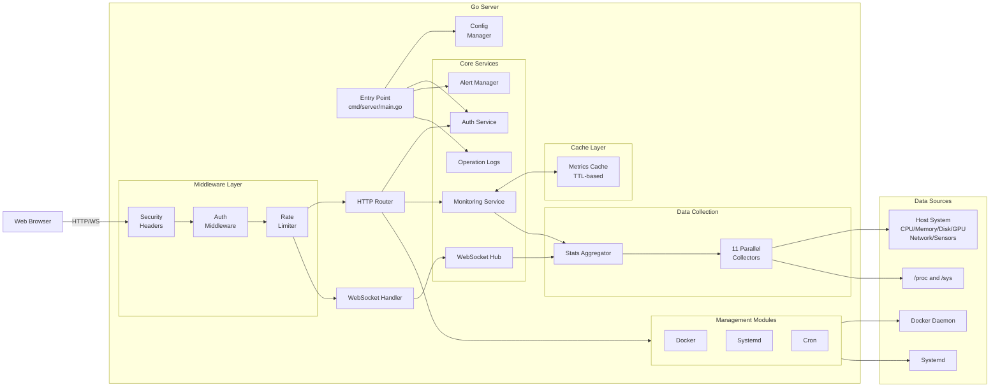

# Web Monitor

<p align="center">
  
  
  
  
</p>

<p align="center">
  <strong>🚀 高性能实时系统监控面板</strong>
</p>

<p align="center">
  基于 Go 构建的轻量级系统监控工具，支持 Docker 容器部署和裸机运行。<br/>
  通过 WebSocket 实时推送，提供 CPU、内存、GPU、网络、Docker、Systemd 等全方位监控。
</p>

<p align="center">
  <a href="./README_EN.md">English</a> | 简体中文
</p>

---

## ✨ 特性

### 📊 实时监控
- **CPU**：使用率、每核心负载、频率、温度历史趋势
- **内存**：物理内存、Swap、缓存、Buffer 详细分析
- **磁盘**：分区信息、使用率、IO 读写、Inode 状态
- **GPU**：NVIDIA GPU 支持（via nvml）- 显存、温度、功耗、进程
- **网络**：接口流量、连接状态、监听端口、Socket 统计
- **进程**：Top 进程列表、CPU/内存占用、IO 统计

### 🔧 系统管理
- **Docker 管理**：容器启停/重启/删除、镜像管理
- **Systemd 服务**：服务列表、启停/重启/启用/禁用
- **Cron 任务**：定时任务增删改查、日志查看
- **进程管理**：进程终止（仅管理员）

### 🔐 安全特性
- **JWT 认证**：安全的 Token 认证机制
- **角色权限**：管理员/普通用户分离
- **速率限制**：登录防暴力破解
- **安全头**：CSP、X-Frame-Options、HSTS 等
- **Token 撤销**：支持登出后 Token 失效

### 🌐 现代化前端
- **实时更新**：WebSocket 双向通信
- **PWA 支持**：可安装为桌面/移动应用
- **响应式设计**：适配各种屏幕尺寸
- **深色主题**：护眼暗色界面
- **图表可视化**：Chart.js 驱动的实时图表

### ⚡ 高性能设计
- **并行采集**：11 个采集器并发运行
- **智能缓存**：TTL 缓存减少系统负载
- **动态采集频率**：根据客户端需求自动调整
- **优雅关闭**：支持信号处理和平滑退出
、


---

## 🚀 快速开始

### Docker 部署（推荐）

```bash
# 克隆仓库
git clone https://github.com/AnalyseDeCircuit/web-monitor.git
cd web-monitor

# 设置环境变量（可选）
export JWT_SECRET="your-secure-secret-key"

# 启动服务
docker compose up -d
```

访问 `http://localhost:38080`，默认账户：
- 用户名：`admin`
- 密码：`admin123`

> ⚠️ **首次登录后请立即修改密码！**

### 裸机部署

```bash
# 构建
go build -mod=vendor -o server ./cmd/server

# 设置环境变量
export PORT=8000
export DATA_DIR=/var/lib/web-monitor

# 运行
./server
```

---

## 📁 项目结构

```
web-monitor/
├── cmd/
│   ├── server/          # 主程序入口
│   └── dockerproxy/     # Docker Socket 代理
├── api/handlers/        # HTTP 路由和处理器
├── internal/
│   ├── auth/            # 认证和授权
│   ├── cache/           # 指标缓存
│   ├── collectors/      # 数据采集器（11个）
│   ├── config/          # 配置管理
│   ├── cron/            # Cron 任务管理
│   ├── docker/          # Docker API 客户端
│   ├── middleware/      # 中间件
│   ├── monitoring/      # 监控服务和告警
│   ├── systemd/         # Systemd 服务管理
│   └── websocket/       # WebSocket Hub
├── pkg/types/           # 公共类型定义
├── static/              # 前端静态资源
├── templates/           # HTML 模板
└── vendor/              # 依赖（离线构建）
```

---

## ⚙️ 配置说明

### 环境变量

| 变量名 | 默认值 | 说明 |
|--------|--------|------|
| `PORT` | `8000` | HTTP 服务端口 |
| `DATA_DIR` | `/data` | 数据存储目录 |
| `JWT_SECRET` | 随机生成 | JWT 签名密钥 |
| `WS_ALLOWED_ORIGINS` | `*` | WebSocket 允许的源 |
| `HOST_FS` | `/hostfs` | 宿主机文件系统挂载点 |
| `DOCKER_HOST` | `unix:///var/run/docker.sock` | Docker API 地址 |

### 容器模式 vs 裸机模式

**容器模式**（自动检测 `HOST_FS`）：
- 通过 `/hostfs` 挂载访问宿主机系统
- 需要特定的 Linux Capabilities

**裸机模式**（`HOST_FS` 为空）：
- 直接访问本机 `/proc`、`/sys` 等
- 无需额外权限配置

### Docker Compose 配置参考

```yaml
services:
  web-monitor-go:
    image: web-monitor-go:latest
    cap_add:
      - SYS_PTRACE        # 读取进程信息
      - DAC_READ_SEARCH   # 读取日志文件
      - SYS_CHROOT        # Cron 管理
    network_mode: host
    pid: host
    volumes:
      - /:/hostfs:ro
      - /run/dbus/system_bus_socket:/run/dbus/system_bus_socket:ro
```

---

## 📡 API 概览

### 认证
| 端点 | 方法 | 说明 |
|------|------|------|
| `/api/login` | POST | 用户登录 |
| `/api/logout` | POST | 用户登出 |
| `/api/password` | POST | 修改密码 |

### 监控数据
| 端点 | 方法 | 说明 |
|------|------|------|
| `/ws/stats` | WebSocket | 实时监控数据流 |
| `/api/system/info` | GET | 系统信息快照 |
| `/api/info` | GET | 静态系统信息 |

### 管理功能（需认证）
| 端点 | 方法 | 说明 |
|------|------|------|
| `/api/docker/containers` | GET | Docker 容器列表 |
| `/api/docker/action` | POST | 容器操作（管理员） |
| `/api/systemd/services` | GET | Systemd 服务列表 |
| `/api/systemd/action` | POST | 服务操作（管理员） |
| `/api/cron/jobs` | GET | Cron 任务列表 |
| `/api/users` | GET/POST | 用户管理（管理员） |

详细 API 文档请参阅 [API_DOCUMENTATION.md](./API_DOCUMENTATION.md)。

---

## 🛡️ 安全建议

1. **修改默认密码**：首次登录后立即修改 admin 密码
2. **设置 JWT_SECRET**：生产环境务必设置强随机密钥
3. **限制网络访问**：建议通过反向代理（Nginx）并启用 HTTPS
4. **Docker Socket 代理**：使用 `docker-socket-proxy` 限制 Docker API 暴露面
5. **定期更新**：关注项目更新以获取安全补丁

---

## 🔌 GPU 支持

### NVIDIA GPU

自动检测并通过 nvml 库采集：
- GPU 使用率
- 显存使用
- 温度/功耗
- GPU 进程

需要在 Docker 中启用 NVIDIA Container Toolkit：

```yaml
environment:
  - NVIDIA_VISIBLE_DEVICES=all
  - NVIDIA_DRIVER_CAPABILITIES=all
```

---

## 📊 架构设计

详细架构图请参阅 [ARCHITECTURE.md](./ARCHITECTURE.md)。

```
┌─────────────┐     ┌──────────────────────────────────────┐
│   Browser   │────▶│            Go Server                 │
│  (WebSocket)│◀────│  ┌─────────┐  ┌──────────────────┐  │
└─────────────┘     │  │ Router  │──│ WebSocket Hub    │  │
                    │  └────┬────┘  └────────┬─────────┘  │
                    │       │                │            │
                    │  ┌────▼────┐  ┌────────▼─────────┐  │
                    │  │ Cache   │◀─│ Stats Aggregator │  │
                    │  └─────────┘  └────────┬─────────┘  │
                    │                        │            │
                    │         ┌──────────────┼──────────┐ │
                    │         ▼              ▼          ▼ │
                    │  ┌──────────┐ ┌──────────┐ ┌──────┐ │
                    │  │Collectors│ │  Docker  │ │Systemd││
                    │  │ (x11)    │ │  Client  │ │ D-Bus ││
                    │  └──────────┘ └──────────┘ └──────┘ │
                    └──────────────────────────────────────┘
```

---

## 🤝 贡献

欢迎提交 Issue 和 Pull Request！

1. Fork 本仓库
2. 创建特性分支 (`git checkout -b feature/amazing-feature`)
3. 提交更改 (`git commit -m 'Add amazing feature'`)
4. 推送到分支 (`git push origin feature/amazing-feature`)
5. 提交 Pull Request

---

## 📄 许可证

本项目采用 [CC BY-NC 4.0 许可证](./LICENSE)（署名-非商业性使用）。

---

## 🙏 致谢

- [gopsutil](https://github.com/shirou/gopsutil) - 跨平台系统信息采集
- [go-nvml](https://github.com/NVIDIA/go-nvml) - NVIDIA GPU 监控
- [gorilla/websocket](https://github.com/gorilla/websocket) - WebSocket 实现
- [Chart.js](https://www.chartjs.org/) - 前端图表库
