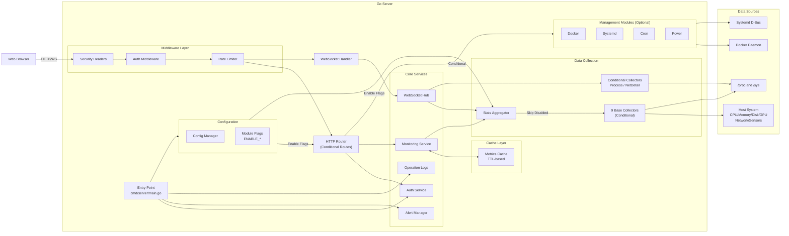
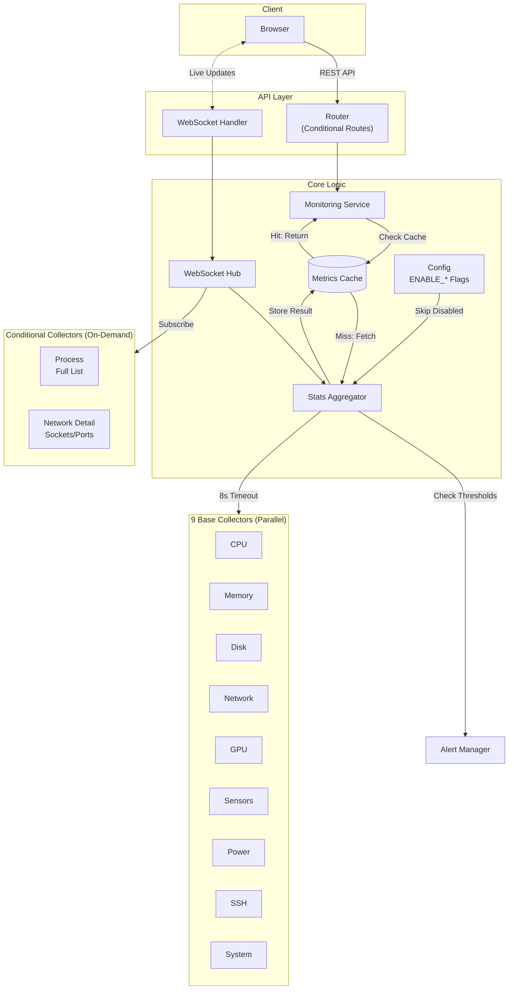
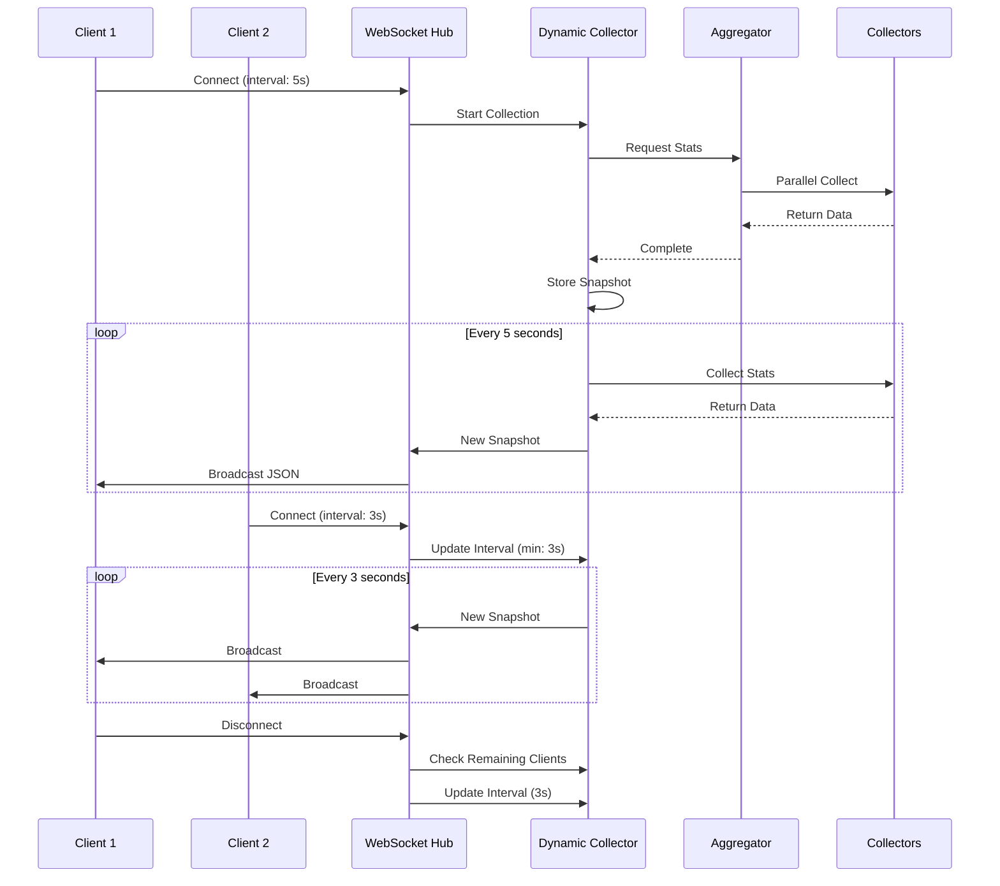
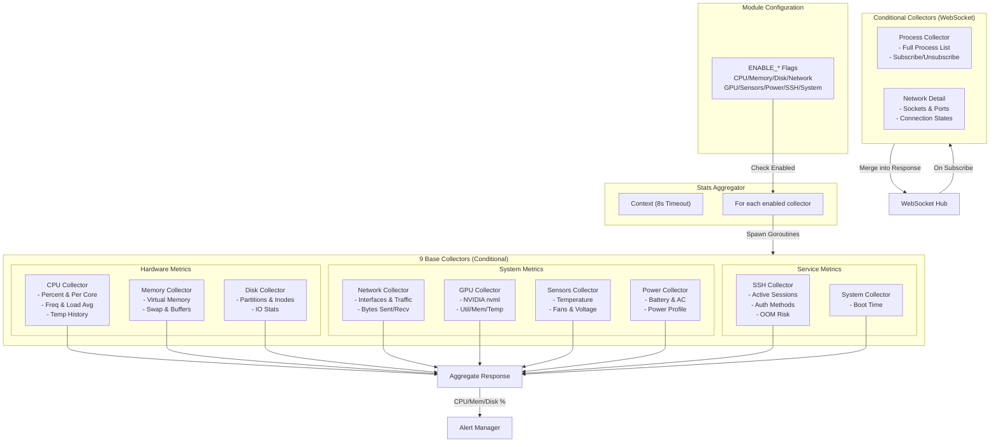
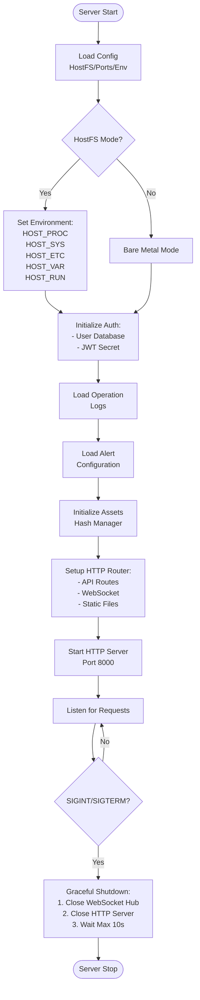
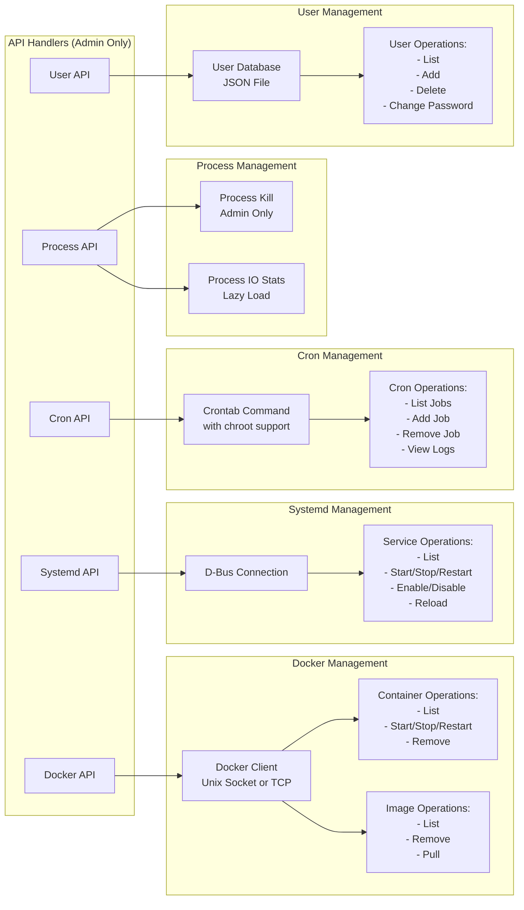
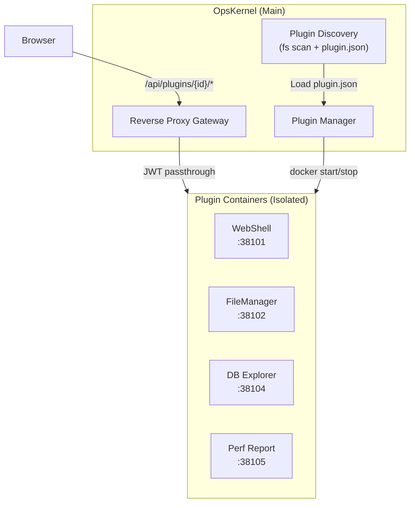

# OpsKernel Architecture

This document describes the high-level architecture of the OpsKernel project.

## Overview

OpsKernel is a real-time system monitoring application consisting of a Go backend and a web-based frontend. The backend collects system metrics and exposes them via REST APIs and WebSockets.

## Architecture Diagram

### System Overview

### Data Flow with Caching

### WebSocket Real-time Broadcasting

### Collectors Architecture

### Initialization Flow

### Management Modules

## Component Description

### 1. Entry Point
- **cmd/server/main.go**: The application entry point that orchestrates the entire startup sequence:
  - Loads configuration (HostFS mode detection for container environments)
  - Initializes user authentication database and JWT secrets
  - Loads operation logs and alert configurations
  - Initializes static asset hash manager for cache busting
  - Sets up HTTP router with all endpoints
  - Starts the HTTP server with graceful shutdown support

### 2. Configuration Management (`internal/config`)
- **Config**: Global configuration manager
  - **HostFS Mode**: Detects container environment and configures paths to access host system metrics
  - **Environment Variables**: HOST_PROC, HOST_SYS, HOST_ETC, HOST_VAR, HOST_RUN
  - **Port Configuration**: Server port (default 8000)
  - **Module Flags**: Enable/disable individual features via environment variables:
    - `ENABLE_CPU`, `ENABLE_MEMORY`, `ENABLE_DISK`, `ENABLE_NETWORK`
    - `ENABLE_SENSORS`, `ENABLE_POWER`, `ENABLE_GPU`, `ENABLE_SSH`, `ENABLE_SYSTEM`
    - `ENABLE_DOCKER`, `ENABLE_CRON`, `ENABLE_SYSTEMD`
  - **Effects**: Disabled modules skip collector execution, API route registration, and frontend UI elements

### 3. Middleware Layer (`internal/middleware`)
- **Security Headers**: Sets CSP, X-Frame-Options, X-Content-Type-Options, etc.
- **Auth Middleware**: Validates JWT tokens from Authorization header or cookies
- **Rate Limiter**: Protects API endpoints from abuse
- **Request Size Limiter**: Prevents large request body attacks (max 2 MiB)

### 4. API Layer (`api/handlers`)
- **Router**: Routes incoming HTTP requests with path-based authorization
- **Handlers**:
    - **Auth**: Login, logout, password management, token validation
    - **System**: Real-time system stats, static info, health checks
    - **Docker**: Container/image management (admin only)
    - **Systemd**: Service management (admin only)
    - **Cron**: Job scheduling management (admin only)
    - **Process**: Process monitoring and kill operations (admin only)
    - **User**: User management (admin only)
    - **Network/Power/SSH**: Specialized monitoring endpoints
    - **WebSocket**: Upgrades connections for real-time streaming
    - **Plugin**: Plugin discovery, lifecycle management, and reverse proxy

### 5. Core Services (`internal`)

#### 5.1 Authentication (`internal/auth`)
- User database management (JSON file-based)
- JWT token generation and validation
- Role-based access control (admin/viewer)
- Password hashing with bcrypt

#### 5.2 Monitoring Service (`internal/monitoring`)
- Orchestrates system metric collection
- **Caching Strategy**: TTL-based cache to reduce system load
- **Alert Management**: Monitors CPU/Memory/Disk thresholds
- Provides both cached and real-time data access

#### 5.3 WebSocket Hub (`internal/websocket`)
- **Connection Management**: Tracks all active WebSocket clients
- **Dynamic Collector**: Adjusts collection interval based on connected clients' needs
- **Broadcast Mechanism**: Sends metric updates to all connected clients
- **Conditional Collectors**: Lazy-load expensive metrics (e.g., network details) only when subscribed

#### 5.4 Stats Aggregator (`internal/collectors/aggregator`)
- **Parallel Execution**: Runs 11 collectors concurrently with context timeout (8s)
- **Result Aggregation**: Combines all collector outputs into a unified response
- **Error Handling**: Gracefully handles individual collector failures
- **Temperature History**: Maintains CPU temperature trends

### 6. Cache Layer (`internal/cache`)
- **MetricsCache**: Thread-safe in-memory cache with TTL
- **Cache Keys**: System metrics, static info, etc.
- **Automatic Cleanup**: Removes expired entries
- **Fallback Strategy**: Returns real-time data on cache miss

### 7. Data Collectors (`internal/collectors`)

**9 Base Collectors** (run in parallel by StatsAggregator, conditional on ENABLE_* flags):

1. **CPU Collector**: Usage percent, per-core stats, frequency, load average, times, temperature history
2. **Memory Collector**: Virtual memory and swap statistics
3. **Disk Collector**: Partition info, usage, filesystem types, IO stats, inodes
4. **Network Collector**: Interface stats, traffic counters (bytes sent/recv)
5. **GPU Collector**: NVIDIA GPU support via nvml (utilization, memory, temperature)
6. **Sensors Collector**: Hardware sensors (temperature, fans, voltage)
7. **Power Collector**: Battery status, AC adapter, power profiles
8. **SSH Collector**: Active sessions, authentication methods, OOM risk processes
9. **System Collector**: Boot time

**2 Conditional Collectors** (lazy-loaded via WebSocket subscription):

1. **Process Collector**: Full process list with CPU/memory/IO stats (expensive, only when subscribed)
2. **Network Detail Collector**: Socket states, listening ports, connection states (only when subscribed)

All collectors use `gopsutil` and respect HostFS environment variables for container deployments.

**Modularity**: Each base collector can be disabled via environment variable. Disabled collectors:
- Do not spawn goroutines in the aggregator
- Their API routes are not registered
- Frontend UI elements are hidden automatically

### 8. Management Modules

#### 8.1 Docker Management (`internal/docker`)
- **Connection**: Unix socket or TCP (docker-socket-proxy support)
- **Container Operations**: List, start, stop, restart, remove
- **Image Operations**: List, remove, pull
- **Read-only Mode**: Configurable for safety

#### 8.2 Systemd Management (`internal/systemd`)
- **D-Bus Connection**: Communicates with systemd via D-Bus
- **Service Operations**: List, start, stop, restart, enable, disable, reload
- **Unit Status**: Load state, active state, sub-state

#### 8.3 Cron Management (`internal/cron`)
- **Crontab Integration**: Direct crontab manipulation with chroot support
- **Job Management**: Add, list, remove jobs with validation
- **Schedule Validation**: Ensures valid cron expressions
- **Log Viewer**: Reads cron job execution logs

#### 8.4 Process Management (`internal/collectors/process`)
- **Process Monitoring**: Top processes by resource usage
- **Lazy IO Loading**: Process IO stats loaded on demand
- **Kill Operations**: Admin-only process termination

### 9. Alert System (`internal/alerts`)
- **Threshold Monitoring**: CPU, Memory, Disk usage alerts
- **Configuration**: JSON-based alert rules
- **Notification**: (Implementation depends on alert handlers)

### 10. Operation Logs (`internal/logs`)
- **Audit Trail**: Records admin operations (user changes, service operations, etc.)
- **Persistence**: JSON file-based storage
- **Query Interface**: List and filter operation logs

### 11. Asset Management (`internal/assets`)
- **Hash-based Versioning**: Generates content hashes for static files
- **Cache Busting**: Enables immutable caching with `/static-hashed/{hash}/{path}`
- **Template Integration**: Provides `asset` function for templates

### 12. Prometheus Integration (`internal/prometheus`)
- **Metrics Exporter**: Exposes `/api/metrics` endpoint
- **Standard Metrics**: Health status, version info, cache size

### 13. Frontend
- **Location**: `templates/` and `static/`
- **Technology**: Vanilla JavaScript + Chart.js
- **Features**:
  - Real-time charts with sparklines and memory pie chart
  - WebSocket-based live updates
  - Service Worker for offline support
  - Responsive design with dark mode
  - Modular JS architecture (api.js, ws.js, state.js, render.js)

### 14. Plugin System (`internal/plugin`)

The plugin system enables extending OpsKernel with isolated components:

**Key Features**:
- **Container Isolation**: Each plugin runs in its own Docker container
- **No Self-Auth**: Plugins trust the main gateway; JWT is passed through
- **Reverse Proxy**: All plugin requests go through `/api/plugins/{id}/`
- **Health Checks**: Main program monitors plugin health endpoints
- **Hot Loading**: Plugins can be installed/started without restarting core

**Built-in Plugins**:
| Plugin | Description | Port |
|--------|-------------|------|
| WebShell | SSH terminal (xterm.js, 24-bit color) | 38101 |
| FileManager | SFTP file browser | 38102 |
| DB Explorer | Database connector | 38104 |
| Perf Report | Performance visualization | 38105 |

**Plugin Development**: See `plugins/DEVELOPMENT.md` for the development guide.
